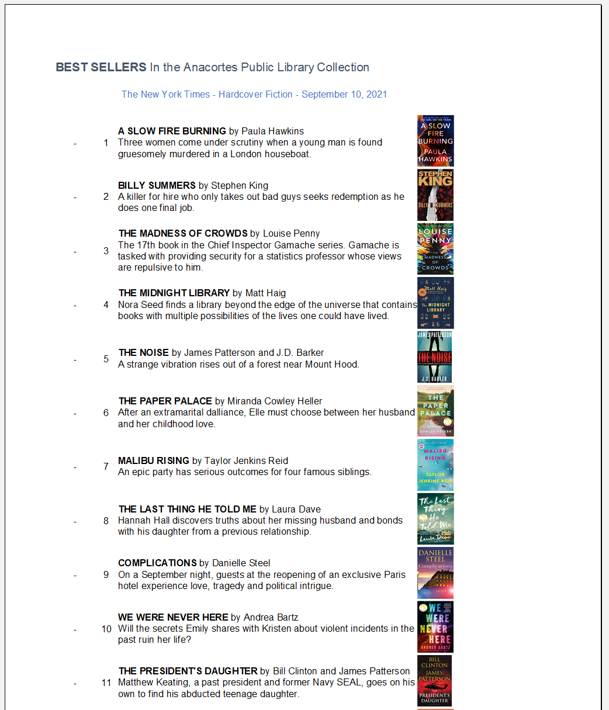

# New York Times Bestseller List Grabber

This program (well, script) will grab and format data from the NYT API to create a printable spreadsheet of the various lists from said NYT API.

The look and feel and styling of the final Excel spreadsheet is pretty set in stone and hardcoded in.

## Usage

Take a look at the docs for some basic instructions and notes on how to run things properly.

I've recently modified the script to only run on Thursdays, as I'm using an online script runner that runs every day so I had to manually specifiy when it should execute.

## Resources

Data is pulled from the [New York Times Developer Network](https://developer.nytimes.com/).

## Sample Output

